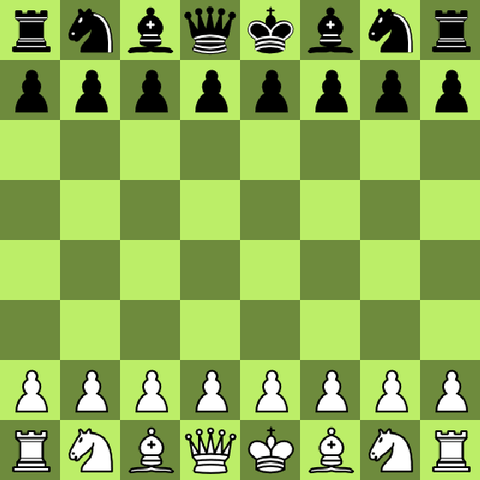

# chess2

A chess game I wrote from scratch in Python, with a pygame GUI and a small AlphaZero-style bot to play against.



*A winning game of my bot (White, MCTS, 400 simulations per move) against Stockfish limited to 1350 Elo*

## What this is

It started as an exercise in writing the rules of chess myself: piece movement, check, castling, en passant, promotion, threefold repetition. All of that lives in my own engine (`board.py`, `pieces/`), and the GUI and human moves run on it.

Later I added a bot. It is a policy/value network combined with Monte Carlo tree search, roughly the AlphaZero recipe, but trained by supervised learning on existing games instead of self-play. For the bot's search I use [python-chess](https://python-chess.readthedocs.io/) for move generation, because it is much faster than my own engine.

## How the bot works

**Input.** A position is encoded from the point of view of the side to move: 12 planes of 8×8 for the pieces (own and opponent, six piece types each) plus 5 planes for castling rights and side to move.

**Network.** A small ResNet with 6 residual blocks and 96 channels, followed by two heads:
- a policy head that scores the 1858 possible moves (the Leela Chess Zero move encoding),
- a value head with a tanh output that estimates the game result from the side to move's view.

**Search.** PUCT Monte Carlo tree search: the policy gives the priors, the value head evaluates leaves, and there are no random rollouts. To keep the network busy, leaves are collected in batches using virtual loss and evaluated in a single forward pass. More simulations means stronger play. Below roughly 400 simulations the search is too shallow and the bot starts hanging pieces.

## Training data

The training data is a Leela Chess Zero dataset (`ccrl-v3.tar.bz2`) built from CCRL engine games. I use 2.5 million positions. They are split by game into 2.3M for training and 200k for validation, so positions from the same game never end up on both sides of the split.

For each position the targets are:
- the move that was played (policy, with label smoothing),
- the final result of the game (value).

Training uses AdamW and runs on Apple Silicon (MPS) or the CPU:

```bash
python -m chess2.bot.regenerate_dataset   # data_leela/ccrl-v3.tar.bz2 -> data_leela/chess_data_list.pkl
python -m chess2.bot.train
```

The raw data isn't in the repo. The trained weights are: `src/chess2/bot/weights/chess2_rb6_c96.pth`.

One bug took me a while to find: the board encoding at play time didn't match the training data for White. Leela mirrors the files in its bitboards, and that mirroring was missing on the inference side. The bot only played properly as Black. Castling had a similar problem: Leela writes it as king-takes-rook (`e1h1`), so the bot almost never castled. `tests/test_encoding.py` now rebuilds real training positions and checks that both paths produce identical tensors and move indices.

## Try it

You need Python 3.13+.

```bash
git clone https://github.com/JonasKuch/chess2.git
cd chess2
uv run chess2
```

`uv run` sets up the environment on the first call. The trained weights (12 MB) ship with the package, so the bot works right away. Without uv: `pip install -e .`, then run `chess2`.

On the start screen you choose your color and whether to play the bot or another person. You move by clicking a piece and then its target square. `<` and `>` take moves back and forward, and `GIVE UP` resigns. Each bot move takes a few seconds, because the search runs 1000 simulations by default. For faster moves, use `uv run chess2 --simulations 400`, or `--no-mcts` for the raw policy. `--help` lists all options.

Two environment variables are useful:
- `CHESS2_MODEL` points to a different weights file (same as `--model`).
- `STOCKFISH_PATH` is needed only if Stockfish isn't on your PATH.

## How strong is it?

On a validation sample of 2000 positions, the network's top move matches the move played in the game about 37% of the time, for both colors.

To measure playing strength I let the bot (MCTS, 400 simulations) play 80 games against Stockfish with limited strength, 20 at each level and with alternating colors:

| Stockfish level | Bot score |
|---|---|
| 1320 | 12.5 / 20 |
| 1400 | 8.5 / 20 |
| 1500 | 5.5 / 20 |
| 1600 | 3 / 20 |

That works out to a performance of roughly **1350 Elo**, give or take about 50. The bot scores about the same with White and Black. This is Elo against Stockfish's limited-strength mode, not a human rating. Games that don't finish within 400 plies are decided by material.

To reproduce it, run `examples/play_strength.py`. You need [Stockfish](https://stockfishchess.org/) for this. Set the levels and the number of games at the top of the script.

## Layout

```
src/chess2/            game rules (board.py, move.py, pieces/) and the game loop (game.py)
src/chess2/gui/        pygame interface
src/chess2/bot/        network, MCTS, data pipeline, training
examples/              play.py, play_strength.py, debug_game.py (headless self-play)
tests/                 encoding check against real training data
```

## Limitations

**The bot**
- No self-play. The bot only imitates the moves in the engine games, so it never learns from its own mistakes.
- The input contains only the current position, with no history. The network can't see repetitions coming.

**My engine**
- Insufficient material isn't detected as a draw.

**The code**
- `training.py`, `dataset.py`, `dataset_filter.py` and the notebooks are earlier experiments. The current pipeline is `regenerate_dataset.py` + `train.py`.

Self-play training on top of the supervised model would be the obvious next step.
